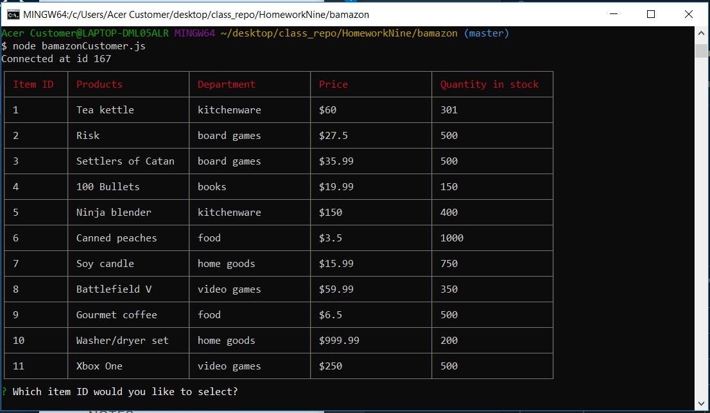
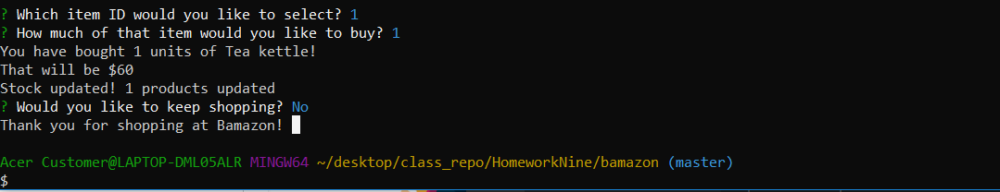
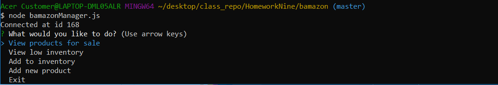
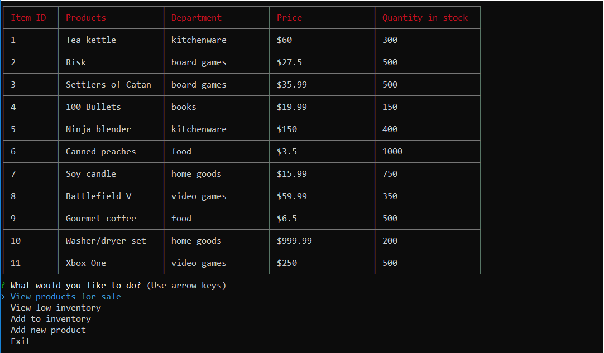
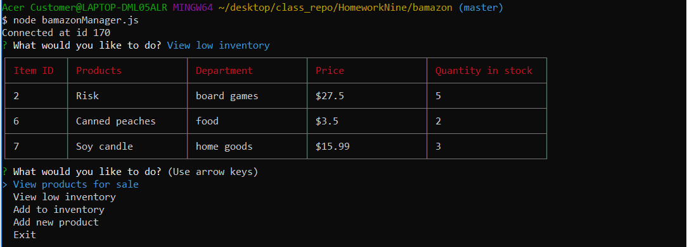
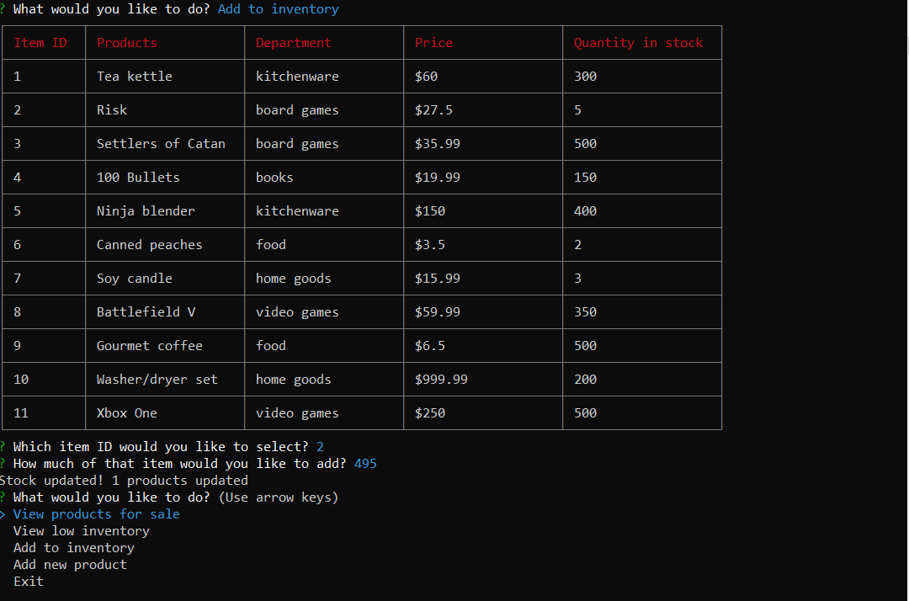
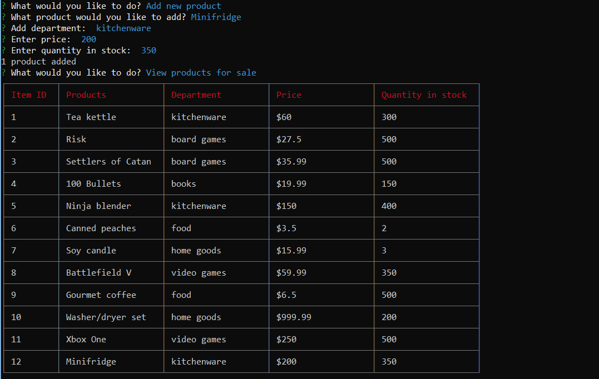

# bamazon

Buy fake stuff for fake money on Bamazon, Node's favorite fake marketplace!

Customers can load the customer view with `node bamazonCustomer.js` in the  terminal. Here you will see products available.

Choose a product and how much you want to buy, and bamazon does the rest!

Managers can load the manager view with `node bamazonManager.js` in the terminal. Here you will see a few options:

Selecting `View products for sale` shows all products available.

Selecting `View low inventory` shows all products with a stock quantity of less than five.

Selecting `Add to inventory` will add stock to any product available.

Selecting `Add new product` will allow you to add a new product to the inventory. Selecting `view products for sale` after will show the new product along with the rest of the products in inventory.

Selecting `Exit` ends the connection to the bamazon database.

